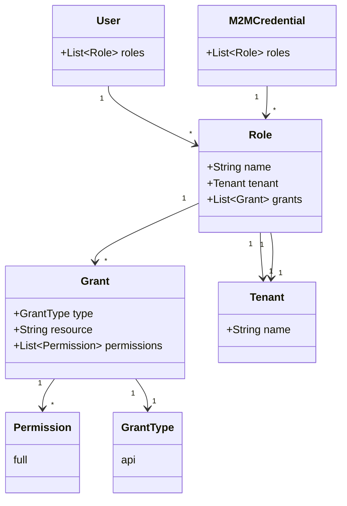

## RBAC in CD-as-a-Service

CD-as-a-Service's RBAC implementation provides you with the following features:

* [System-defined roles](#system-roles) for admins and machine-to-machine credentials.
* [Custom roles](#custom-role-examples) that you create to fit your company's needs.
* [SSO groups to custom RBAC roles mapping](#sso-groups-and-rbac-roles).
* Role-based deployment approval.

### RBAC implementation



Central to CD-as-a-Service's [RBAC](https://en.wikipedia.org/wiki/Role-based_access_control) implementation is a _Role_, which defines what a user can do within the platform. Each Role has a _Grants_ collection that defines permissions.

You define your custom RBAC roles in a YAML file that has this structure:

```yaml
roles:
  - name: ROLE_NAME
    tenant: TENANT_NAME
    grants:
      - type: TYPE
        resource: RESOURCE
        permission: PERMISSION
```

* `name`: (Required) The name for this role.
* `tenant`: (Optional) The name of an existing tenant. The role is scoped to the tenant. You can create an organization-wide role by omitting the `tenant` definition.

#### Grants

(Required)

A _Grant_ has type, resource, and permission attributes. 

* `type`: (Required)ingle choice: `api`.
* `resource`: (Required) Defines what area the Grant can access. It has the following values:

  * `tenant`: When you use `tenant` as the `resource`, the Grant allows access to the tenant that you specify in the `roles.tenant` field. You use `tenant` when you define a [Tenant Admin role](#tenant-admin-role).
  * `deployment`: This resource allows the role to deploy using the CLI and manage deployments in the **Deployments** UI. If you omit `roles.tenant`, the role has this Grant across your organization.
  * `organization`: Use this resource when you need to create an Organization Admin role that maps to an SSO group. 
  
* `permission`: (Required) The only option is `full`.

#### System roles

CD-as-a-Service provides the following system roles:

* Organization Admin
  * Grants:
    * UI - full access to all screens and functionality
    * CLI -  full authority to execute all CLI commands
  * Assignment:  
    * CD-as-a-Service assigns this role to the person who creates a new CD-as-a-Service account (Organization).
    * You are able to manually assign the Organization Admin role to all users you invite to your Organization, thus bypassing the need to create custom RBAC roles.
* Deployments Full Access
  * Grants:
    * This role grants full authority to trigger deployments.
  * Assignment:
    * Assign this role to Client Credentials that you plan to use with CI tools like GitHub Actions.
* Remote Network Agent
  * Grants:
    * This role grants a Remote Network Agent access to CD-as-a-Service.
  * Assignment:
    * Assign this role to all Client Credentials you create to use with Remote Network Agents.

### Custom role examples

#### Tenant Admin role

This example defines three Tenant Admin roles, one for each tenant. Each role has full authority within the specified tenant.

```yaml
roles:
  - name: Tenant Admin Main
    tenant: main
    grants:
      - type: api
        resource: tenant
        permission: full
  - name: Tenant Admin Finance
    tenant: finance
    grants:
      - type: api
        resource: tenant
        permission: full
  - name: Tenant Admin Commerce
    tenant: commerce
    grants:
      - type: api
        resource: tenant
        permission: full
```

If you want to grant a user permission to manage all of your tenants, assign that user the **Organization Admin** role using the UI.

#### Deployment roles

This example defines a role that grants permission to use the **Deployments** UI and start deployments using the CLI. The role is bound to the `finance` tenant.

```yaml
roles:
  - name: Deployer Finance
    tenant: finance
    grants:
      - type: api
        resource: deployment
        permission: full
```

This next example defines a role that grants permission to use the **Deployments** UI and start deployments using the CLI across your entire organization. Note that `tenant` is not defined, which makes this an organization-wide role.

```yaml
roles:
  - name: Deployer All Tenants
    grants:
      - type: api
        resource: deployment
        permission: full
```

## {}

Use the CLI to [add your roles]() to your CD-as-a-Service organization. You do all subsequent role management with the CLI, but you [assign roles to users]() using the UI.
